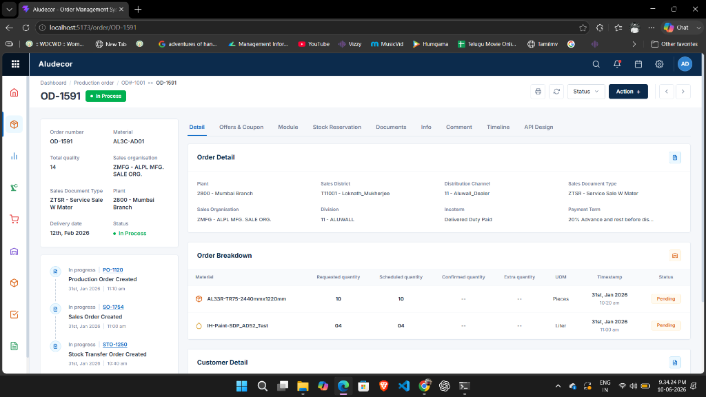
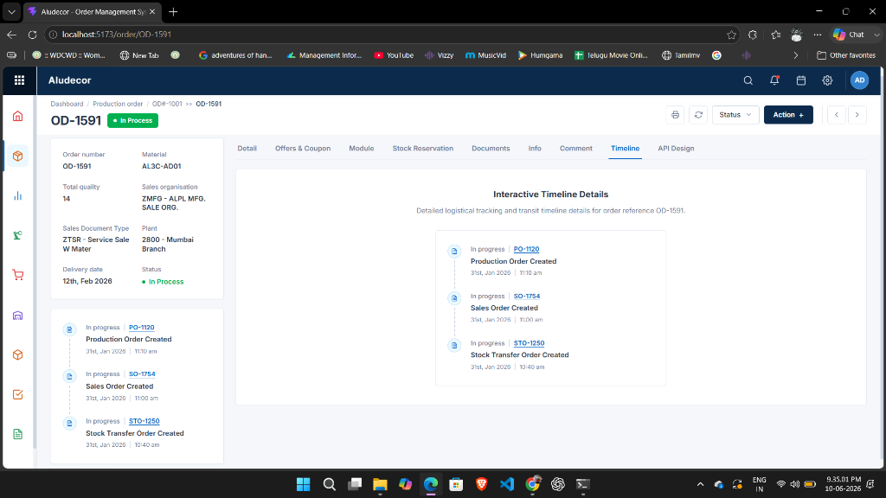
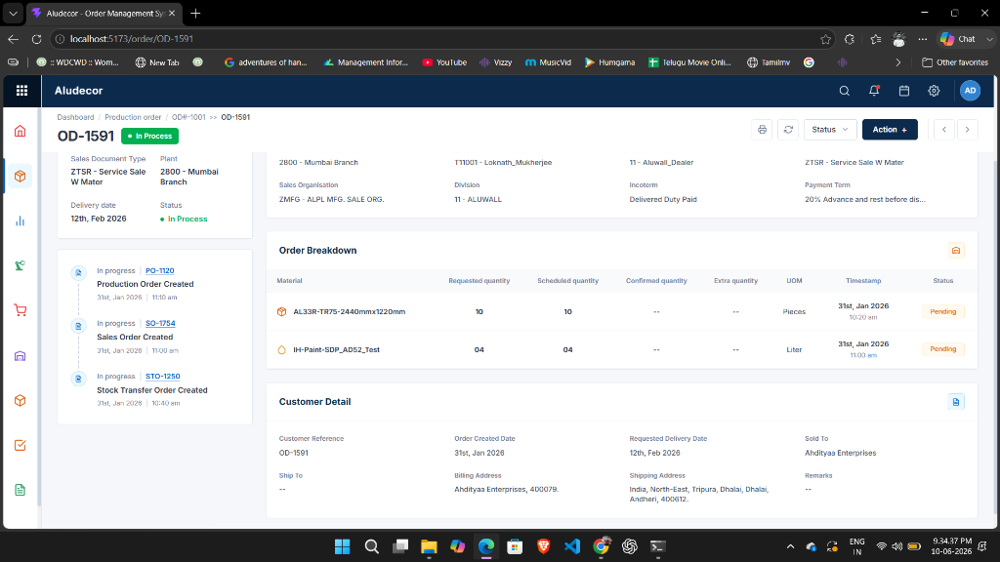
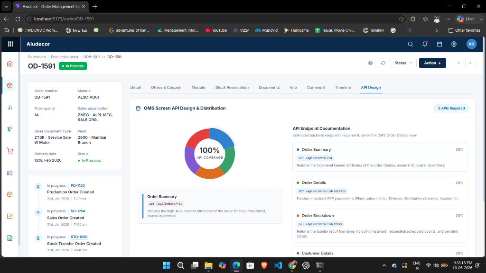

# Aludecor - Order Management System (OMS) Dashboard

A production-quality React 18+ and Vite application replicating the Aludecor Order Management System (OMS) order details screen. The dashboard demonstrates a professional React component-based architecture, clean CSS Module styling, full responsiveness, parallel Axios data loading, and an interactive API Design and Documentation module.

---

## 📸 Screenshots

Here is a visual overview of the dashboard's user interface:

### Order Details View (Details Tab)


### Interactive Timeline (Timeline Tab)


### Order Breakdown & Customer details (Scrolled View)


### Interactive API Design & Distribution (API Design Tab)


---

## 🚀 Getting Started

### Prerequisites
Make sure you have **Node.js (v18 or higher)** and **npm** installed on your system.

### Installation & Local Setup

1. **Clone or Extract the Project**
   Navigate to the project root directory in your terminal:
   ```bash
   cd "d:/OMS React Dashboard Project"
   ```

2. **Install Dependencies**
   Download and install all project dependencies including `react-router-dom`, `axios`, and `react-icons`:
   ```bash
   npm install
   ```

3. **Start the Development Server**
   Run the local Vite development server:
   ```bash
   npm run dev
   ```

4. **Open in Browser**
   Click the local address shown in your terminal (usually `http://localhost:5173`) to open the app.

5. **Build for Production**
   To build the production bundle:
   ```bash
   npm run build
   ```
   To preview the built production output:
   ```bash
   npm run preview
   ```

---

## 📁 Folder Structure

The application is structured into modular layers ensuring scalability, separation of concerns, and clean import paths:

```text
src/
│
├── assets/                 # SVGs and static visual assets
│
├── components/             # Reusable UI Components
│   ├── ApiChart/           # Interactive API Pie Chart & Documentation
│   ├── CustomerDetails/    # Customer references, billing, shipping
│   ├── Navbar/             # Top navigation bar & user profile
│   ├── OrderBreakdown/     # Line items table with quantities
│   ├── OrderDetails/       # Order-level ERP grid attributes
│   ├── OrderHeader/        # Breadcrumbs, header titles & control actions
│   ├── OrderInformation/   # Vertical summary panel (Left column)
│   ├── Sidebar/            # Left navigation ERP icon sidebar
│   └── Timeline/           # Order creation progress timeline
│
├── data/                   # Mock Data responses
│   └── mockData.js         # JSON structures for all APIs
│
├── pages/                  # Top-level Page Views
│   └── OrderDetailsPage.jsx# Coordinates lifecycle & layout split
│
├── services/               # Core services
│   └── api.js              # Axios client configured with mock interceptors
│
├── App.jsx                 # Routes management and base structure
├── index.css               # Global styling, theme tokens & fonts
└── main.jsx                # App bootstrap mounting
```

---

## 🔌 API Design Documentation

The screen requires **5 backend REST APIs** to populate sections independently. Splitting the endpoints:
- **Reduces Payload Size**: Avoids fetching large, nested JSON files in a single query.
- **Prevents Costly DB Joins**: Keeps tables (Orders, Customers, Logistical Items, and Audit History) separated in database-level queries.
- **Supports Partial Polling**: Enables refreshing dynamic items (like timeline stages or confirmed item counts) without refetching static properties (like customer addresses or order headers).

### Number of APIs Required: 5

---

### 1. Order Summary API
- **Endpoint**: `GET /api/orders/:id`
- **Description**: Returns the high-level header attributes used in the top-left summary card.
- **Mock Response**:
  ```json
  {
    "id": "OD-1591",
    "orderNumber": "OD-1591",
    "material": "AL3C-AD01",
    "totalQuality": 14,
    "salesOrganization": "ZMFG - ALPL MFG. SALE ORG.",
    "salesDocumentType": "ZTSR - Service Sale W Mater",
    "plant": "2800 - Mumbai Branch",
    "deliveryDate": "12th, Feb 2026",
    "status": "In Process"
  }
  ```

### 2. Order Details API
- **Endpoint**: `GET /api/orders/:id/details`
- **Description**: Fetches structural ERP parameters of the order for the "Order Detail" grid.
- **Mock Response**:
  ```json
  {
    "id": "OD-1591",
    "plant": "2800 - Mumbai Branch",
    "salesDistrict": "T11001 - Loknath_Mukherjee",
    "distributionChannel": "11 - Aluwall_Dealer",
    "salesDocumentType": "ZTSR - Service Sale W Mater",
    "salesOrganization": "ZMFG - ALPL MFG. SALE ORG.",
    "division": "11 - ALUWALL",
    "incoterm": "Delivered Duty Paid",
    "paymentTerm": "20% Advance and rest before dis..."
  }
  ```

### 3. Order Breakdown Items API
- **Endpoint**: `GET /api/orders/:id/items`
- **Description**: Returns the tabular list of line items including materials, requested/scheduled counts, and pending status.
- **Mock Response**:
  ```json
  [
    {
      "id": "item-1",
      "material": "AL33R-TR75-2440mmx1220mm",
      "requestedQuantity": "10",
      "scheduledQuantity": "10",
      "confirmedQuantity": "--",
      "extraQuantity": "--",
      "uom": "Pieces",
      "timestamp": "31st, Jan 2026 10:20 am",
      "status": "Pending"
    },
    {
      "id": "item-2",
      "material": "IH-Paint-SDP_AD52_Test",
      "requestedQuantity": "04",
      "scheduledQuantity": "04",
      "confirmedQuantity": "--",
      "extraQuantity": "--",
      "uom": "Liter",
      "timestamp": "31st, Jan 2026 11:00 am",
      "status": "Pending"
    }
  ]
  ```

### 4. Customer Details API
- **Endpoint**: `GET /api/orders/:id/customer`
- **Description**: Fetches customer profiles, billing addresses, shipping addresses, and special remarks.
- **Mock Response**:
  ```json
  {
    "id": "OD-1591",
    "customerReference": "OD-1591",
    "orderCreatedDate": "31st, Jan 2026",
    "requestedDeliveryDate": "12th, Feb 2026",
    "soldTo": "Ahdityaa Enterprises",
    "shipTo": "--",
    "billingAddress": "Ahdityaa Enterprises, 400079.",
    "shippingAddress": "India, North-East, Tripura, Dhalai, Dhalai, Andheri, 400612.",
    "remarks": "--"
  }
  ```

### 5. Timeline Events API
- **Endpoint**: `GET /api/orders/:id/timeline`
- **Description**: Returns chronological lifecycle stages tracking Production Orders, Sales Orders, and Stock Transfer Orders.
- **Mock Response**:
  ```json
  [
    {
      "id": "evt-1",
      "status": "In progress",
      "orderId": "PO-1120",
      "eventTitle": "Production Order Created",
      "date": "31st, Jan 2026",
      "time": "11:10 am"
    },
    {
      "id": "evt-2",
      "status": "In progress",
      "orderId": "SO-1754",
      "eventTitle": "Sales Order Created",
      "date": "31st, Jan 2026",
      "time": "11:00 am"
    },
    {
      "id": "evt-3",
      "status": "In progress",
      "orderId": "STO-1250",
      "eventTitle": "Stock Transfer Order Created",
      "date": "31st, Jan 2026",
      "time": "10:40 am"
    }
  ]
  ```

---

## 📊 API Summary Chart & Tab

We have built a dedicated **API Design** tab in the main tab menu. It includes:
1. **Interactive SVG Pie Chart**: Displays a 5-slice segment split representing the equal 20% distribution of these endpoints. Hovering over a segment updates the inspection card to show that endpoint's route, data load role, and properties.
2. **Interactive Docs List**: Matches the color legends, highlighting as you hover over the chart, displaying full JSON shapes and requirements.

---

## 🛠️ Design Assumptions & Technical Notes

- **CSS Modules**: Chosen to keep component styles scoped and modular. Theme values are mapped via global CSS variables in `src/index.css`.
- **Axios Interceptor Mock**: A custom request interceptor intercepts Axios requests matching `/api/orders/*` and returns mock responses with an artificial delay (200ms - 500ms) to simulate loading spinners and real-world backend API latency.
- **Icon Selection**: Utilized icons from `react-icons/fi` (Feather Icons) and `react-icons/md` (Material Design Icons) to recreate the exact graphical cues of the original ERP interface.
- **UOM Paint Icon**: In the Breakdown Table, the row containing `IH-Paint` automatically renders a droplet (`FiDroplet`) icon instead of the default package icon because UOM is in `Liter`, proving strict domain-specific UI attention.
- **Routing**: `react-router-dom` routes specific order IDs to the details page (e.g. `/order/OD-1591`). Any root request is automatically redirected to this view.
- **Responsiveness**: All cards are structured using media-query grids that stack columns on mobile or small tablets and slide the sidebar gracefully.
